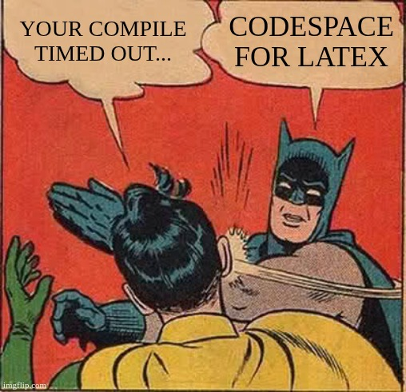

# TeamTex (TMT)

[](https://github.com/yursds/teamtex/releases)
[](https://github.com/yursds/teamtex/actions/workflows/docker-publish.yml)
[](https://github.com/yursds/teamtex/actions/workflows/latex-check.yml)
[](https://opensource.org/licenses/MIT)
[](https://github.com/yursds/teamtex)
[](https://codespaces.new/yursds/teamtex)

TeamTex is a lightweight and customizable LaTeX environment built for Dev Containers, GitHub Codespaces, and robust local usage.

---

<p align="center">
  
</p>

## TL;DR (Quick Start)

1. **Click "Use this template"** on GitHub to create your own repository.
2. **Open the Environment:**
   - **Codespace (VS Code - Recommended):** Install _GitHub Codespaces_ extension in VS Code, `Ctrl+Shift+P` > **Create New Codespace**. (Lowest latency)
   - **Codespace (Browser):** Open repo on GitHub > `Code` > `Codespaces` > `Create codespace`. (Zero setup)
   - **Local Dev Container:** Clone repo, open in VS Code, and click **Reopen in Container**. (Offline / Local Docker)
3. **Wait** for the environment to load.
4. Open `main.tex` and start typing. Every **save (Ctrl + S)** compiles automatically!
5. Find your PDF in the `build/` folder.

---

## Workspace Directory Handling

Whether you are using GitHub Codespaces or Local Dev Containers, your entire repository is automatically mapped inside the container to the `/workspace` directory.

Any files, scripts, images, or custom sub-folders (e.g., `src/`, `chapters/`, `assets/`) you add to your project folder alongside `main.tex` are instantly loaded, fully accessible by LaTeX during compilation, and synced with your local machine/GitHub.

---

## More Usage Details

> [!IMPORTANT]
> **Check the [More Usage Details](docs/usage-details.md) guide** for essential information on **Templates**, **Copilot**, **Troubleshooting**, and **Custom Extensions**. This is where you'll find everything you need for a professional setup.

---

## Table of Contents

1. [Compiling the Project](#compiling-the-project)
2. [Exporting (ZIP & PDF)](#exporting-zip--pdf)
3. [Detailed Guides](#detailed-guides)
   - [Work Environments](docs/environments.md)
   - [Git Workflow & Best Practices](docs/git-workflow.md)
   - [More Usage Details](docs/usage-details.md)

---

## Compiling the Project

The project is specifically configured to keep the root directory clean by routing all files into the `build/` directory.

### Option A: VS Code / Codespace (Recommended)

1. Open `main.tex`.
2. Saving (Ctrl + S) triggers automatic compilation.
3. Use the TeX sidebar icon for manual builds or to view the PDF.

### Option B: Terminal

If you prefer the command line, use `latexmk` directly:

```bash
# Full Compile (handles bibliography, multiple passes automatically)
latexmk -pdf -outdir=build main.tex

# Clean
latexmk -C -outdir=build
rm -rf build/
```

---

## Exporting (ZIP & PDF)

### Download PDF

- **Codespaces / Remote:** Right-click `main.pdf` in the `build/` folder > **Download**.
- **Local Dev Container:** The PDF is already in your local `build/` folder.

### Download Source (ZIP)

To get a clean archive of your source code (excluding build files and Git history):

- **Run `./export_source.sh`** in the terminal.
- **Based on your environment:**
  - **Codespaces / Remote:** Right-click the generated `teamtex_source.zip` > **Download**.
  - **Local Dev Container:** The ZIP is already in your project folder.

---

## Detailed Guides

| Guide                                           | Description                                                 |
| :---------------------------------------------- | :---------------------------------------------------------- |
| [**Work Environments**](docs/environments.md)   | How to setup Codespaces, Local Docker, or Native LaTeX.     |
| [**Git Workflow**](docs/git-workflow.md)        | Divergent branches, Codespace persistence, and branching.   |
| [**More Usage Details**](docs/usage-details.md) | Templates, Copilot, Troubleshooting, and custom extensions. |

> [!TIP]
> **Don't stop at the Quick Start!** We highly recommend reading through all the detailed guides above to fully master the TeamTex environment and its collaborative features.

---
